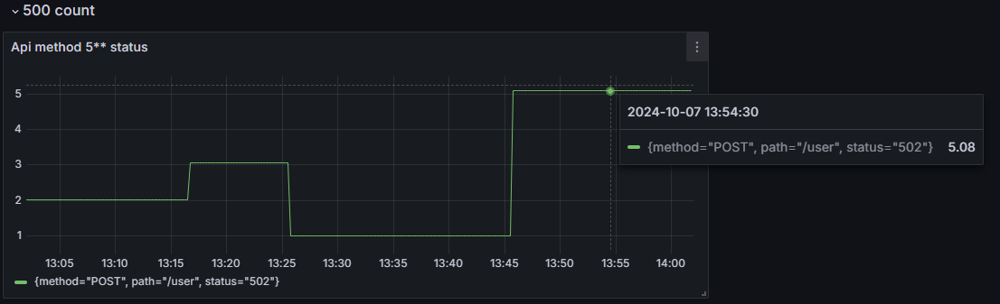
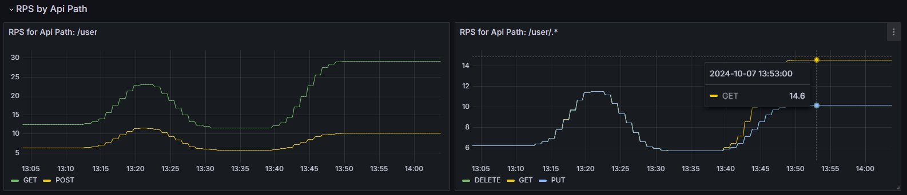
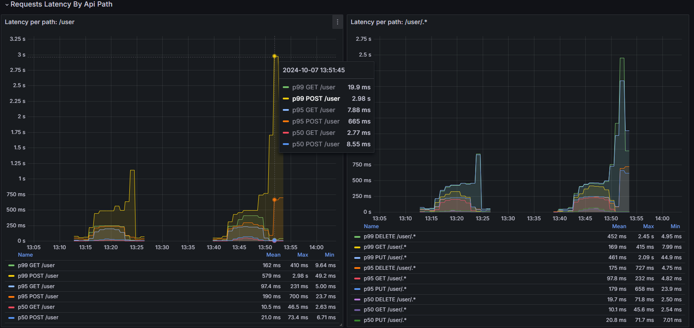
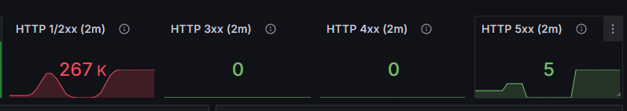
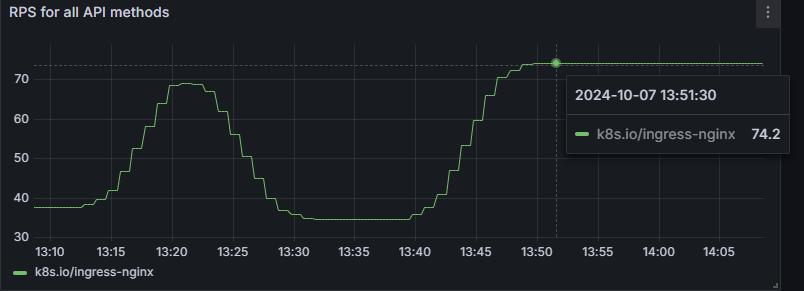
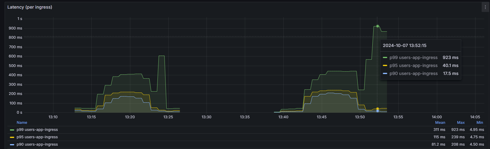

### ссылки:

https://medium.com/@gayatripawar401/deploy-prometheus-and-grafana-on-kubernetes-using-helm-5aa9d4fbae66
https://www.youtube.com/watch?v=2ESOGJTXv1s

Продолжал работку в папке `homework-4`

### установил prometheus в app, залил в докер.

без комментариев ))

### установка и запуск прложения (в него (helm) добавил и графану)

Команды запускать в папке helmchart (`cd homework-4/users-app`):

не забыть обновить dependencies :

```bash
helm dependency update
```

и запускаем helm:

```bash
helm upgrade --install users-app . -n homework-5 --create-namespace
```

если надо тесты запустить, то:

```bash
#homework-4/
cd ../
newman run otus-homework-4.postman_collection.json
```

залогинился в Графана:
user `admin`, password: `admin`:

```bash
#находим существующий сервис графаны "user-app-grafana"
kubectl get svc
# если есть, то проксируем его в локалхост (отдельный терминал)
minikube service users-app-grafana -n homework-5
```

Прометей, если надо тестировать запросы:

```bash
#(отдельный терминал)
minikube service users-app-prometheus-server -n homework-5
```

# Тепрь к дашбордам:

Я взял готовй за основу "Kubernetes Nginx Ingress Prometheus NextGen" (ID 14314), а затем поправил под себя:

Сам дашборд в файле [grafana-ingress.json](grafana-ingress.json)

#### Скриншоты разбикви по апи методам (тут я наверно не доконца понял как именно сделать, но вот что получилось):

500:


RPS:


Latency:


#### Скриншоты с метрикам в целом по сервису, взятые с nginx-ingress-controlle:

500 (справа):


RPS:


Latency:


и лерты при Latency и 500:

