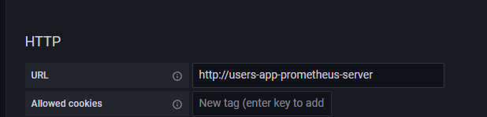
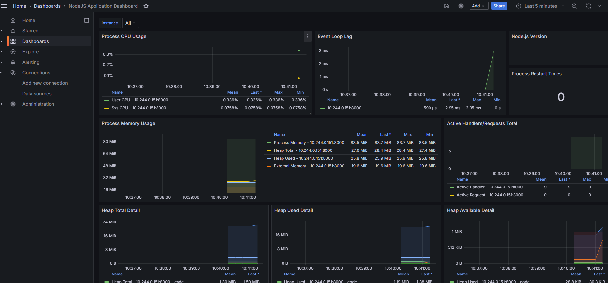

### ссылки:

https://medium.com/@gayatripawar401/deploy-prometheus-and-grafana-on-kubernetes-using-helm-5aa9d4fbae66
https://www.youtube.com/watch?v=2ESOGJTXv1s

### установил prometheus в app, залил в докер.

без комментариев ))

### установка и запуск графаны

В helmchart добавил dependency

```yaml
dependencies:
  - name: prometheus
    version: "15.18.0"
    repository: "https://prometheus-community.github.io/helm-charts"
  - name: grafana
    version: "6.43.5"
    repository: "https://grafana.github.io/helm-charts"
```

в helmchart values.yaml добавил:

```yaml
prometheus:
  alertmanager:
    enabled: false

  pushgateway:
    enabled: false

  nodeExporter:
    enabled: false

grafana:
  persistence:
    enabled: true
  service:
    type: NodePort
```

не забыть обновить dependencies (В папке helmchart (`cd homework-4/users-app`)):

```bash
helm dependency update
```

и запускаем helm:

```bash
helm install users-app .
```

залогинился в Графана:

```bash
#находим существующий сервис графаны "user-app-grafana"
kubectl get svc
# если есть, то проксируем его в локалхост (отдельный терминал)
minikube service user-app-grafana
```

user `admin`, password:

```bash
#get secrete vaule for powershell
kubectl get secret users-app-grafana -o jsonpath="{.data.admin-password}" | ForEach-Object { [System.Text.Encoding]::UTF8.GetString([System.Convert]::FromBase64String($_)) }
# ... or for bash:
kubectl get secret users-app-grafana -o jsonpath="{.data.admin-password}" | base64 --decode ; echo
```

Добавил в Grafana datasorce prometheus по ссылке в кластере (`users-app-prometheus-server`)



для node.js использовал готовый grafana dashboard ID: 11159

<a name="result">🔗</a>вот что получилось:

